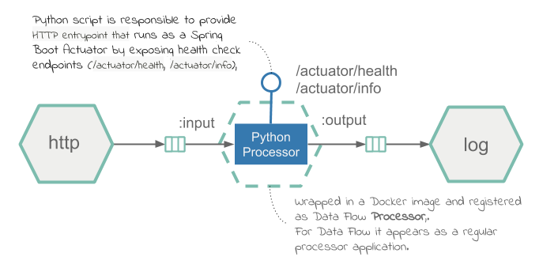

# Python Stream Processor

The example code in this section shows how to run a Python script as a processor within a Data Flow Stream.

In this guide, we package the Python script as a Docker image and deploy it to Kubernetes. We use Apache Kafka as the messaging middleware.
We register the Docker image in Data Flow as an application of type `Processor`.

The guide demonstrates a text-processing streaming data pipeline. It receives text-messages over HTTP, delegates the text processing to a Python script registered as a Data Flow processor, and prints the result to the logs. The Python script reverses the input text if the `reversestring` property is set to `true`. Otherwise, the resulting message remains unchanged.

The following diagram shows the text-reversing processing pipeline:



## Development

You can find the source code in the samples GitHub [repository](https://github.com/spring-cloud/spring-cloud-dataflow-samples/tree/master/dataflow-website/recipes/polyglot/polyglot-python-processor) and download it as a zipped archive from [polyglot-python-processor.zip](https://github.com/spring-cloud/spring-cloud-dataflow-samples/raw/master/dataflow-website/recipes/polyglot/polyglot-python-processor.zip).

The processor uses the [kafka-python](https://github.com/dpkp/kafka-python) library to create consumer and producer connections.

The main loop of execution resides in [python_processor.py](https://github.com/spring-cloud/spring-cloud-dataflow-samples/blob/master/dataflow-website/recipes/polyglot/polyglot-python-processor/python_processor.py).
For each message received on the inbound Kafka topic, the script either sends the output to the Kafka topic as-is, or, if `--reversestring=true` is passed to the processor as part of the stream definition, reverses the string and then sends it to the output. The following listing shows `python_processor.py`:

```python
#!/usr/bin/env python

import os
import sys

from kafka import KafkaConsumer, KafkaProducer
from util.http_status_server import HttpHealthServer
from util.task_args import get_kafka_binder_brokers, get_input_channel, get_output_channel, get_reverse_string

consumer = KafkaConsumer(get_input_channel(), bootstrap_servers=[get_kafka_binder_brokers()])
producer = KafkaProducer(bootstrap_servers=[get_kafka_binder_brokers()])

HttpHealthServer.run_thread()

while True:
    for message in consumer:
        output_message = message.value
        reverse_string = get_reverse_string()

        if reverse_string is not None and reverse_string.lower() == "true":
            output_message = "".join(reversed(message.value))

        producer.send(get_output_channel(), output_message)
```

Helper methods are defined in a utility file called `task_args.py`. They aid in extracting common environment and command line values.

An `HTTPServer` implementation runs as a thread that responds to Spring Boot path health check endpoints (`/actuator/health` and `/actuator/info`) with a default implementation of always returning HTTP 200. A `Dockerfile` creates the image.

For `python_processor.py` to act as a Data Flow `processor`, it needs to be bundled in a docker image and uploaded to `DockerHub`. The following [Dockerfile](https://github.com/spring-cloud/spring-cloud-dataflow-samples/blob/master/dataflow-website/recipes/polyglot/polyglot-python-processor/Dockerfile) shows how to bundle a Python script into a Docker image:

```docker
FROM springcloud/openjdk:latest

RUN apt-get update && apt-get install --no-install-recommends -y \
    python-pip \
 && rm -rf /var/lib/apt/lists/*

RUN pip install kafka-python

COPY python_processor.py /processor/
COPY util/*.py /processor/util/

ENTRYPOINT ["python", "/processor/python_processor.py", "$@", "--"]
```

The Dockerfile installs the required dependencies, adds the `python_processor.py` script and utilities (under the `util` folder), and sets the command entry.

### Build

We can now build the Docker image and push it to the DockerHub registry. To do so:

1. Check out the [sample project](https://github.com/spring-cloud/spring-cloud-dataflow-samples) and navigate to the `polyglot-python-processor` folder:

   ```bash
   git clone https://github.com/spring-cloud/spring-cloud-dataflow-samples
   cd ./spring-cloud-dataflow-samples/dataflow-website/recipes/polyglot/polyglot-python-processor/
   ```

1. From within the `polyglot-python-processor/`, build and push the `polyglot-python-processor` Docker image to DockerHub:

   ```bash
   docker build -t springcloud/polyglot-python-processor:0.1 .
   docker push springcloud/polyglot-python-processor:0.1
   ```

   <!--TIP-->

   Replace `springcloud` with your docker hub prefix.

   <!--END_TIP-->

Once published in Docker Hub, you can register the image in Data Flow and deploy it.

## Deployment

To deploy the processor:

1. Follow the [installation instructions](%currentPath%/installation/kubernetes/) to set up Data Flow on Kubernetes.

1. Retrieve the Data Flow URL from Minikube by running the following command:

   ```bash
   minikube service --url scdf-server
   ```

1. Configure your Data Flow shell by running the following command:

   ```bash
   dataflow config server --uri <Your Data Flow URL>
   ```

1. Import the SCDF app starters

   ```bash
   app import --uri https://dataflow.spring.io/kafka-docker-latest
   ```

1. Register the `polyglot-python-processor` as `python-processor` of type `processor`.

   ```bash
   app register --type processor --name python-processor --uri docker://springcloud/polyglot-python-processor:0.1
   ```

   `docker://springcloud/polyglot-python-processor:0.1` is resolved from the [DockerHub repository](https://hub.docker.com/r/springcloud/polyglot-python-processor).

1. Create the Data Flow `text-reversal` Stream by running the following command:

   ```
   stream create --name text-reversal --definition "http --server.port=32123 | python-processor --reversestring=true  | log"
   ```

   The `http` source listens for incoming HTTP messages on port `32123` and forwards them to the `python-processor`. The processor is configured to reverse the input messages (if `reversestring=true`) and sends them downstream to the `log` sink.

1. Deploy the stream by using the `kubernetes.createNodePort` property to expose the HTTP port to the local host by running the following command:

   ```
   stream deploy text-reversal --properties "deployer.http.kubernetes.createNodePort=32123"
   ```

1. Retrieve the `http-source` URL from minikube to publish the test data by running the following command:

   ```bash
   minikube service --url text-reversal-http-v1
   http://192.168.99.104:32123
   ```

1. Post a sample message against the `http-source` application by running the following command:

   ```
   http post --target http://192.168.99.104:32123 --data "hello world"
   ```

   If the post is successful, you should see a confirmation message like this:

   ```
   > POST (text/plain) http://192.168.99.104:32123 hello world
   > 202 ACCEPTED
   ```

1. Inspect the logs for posted message by running the following command

   ```
   kubectl logs -f <log pod name>
   ```

   You should see output similar to the following:

   ```
   INFO 1 --- [container-0-C-1] log-sink                                 : dlrow olleh
   ```

   You should see the posted message in reversed order (in this case, `dlrow olleh`).
